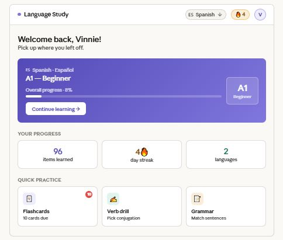
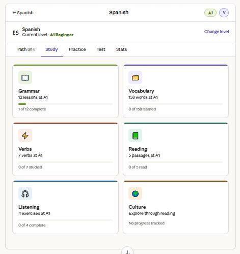
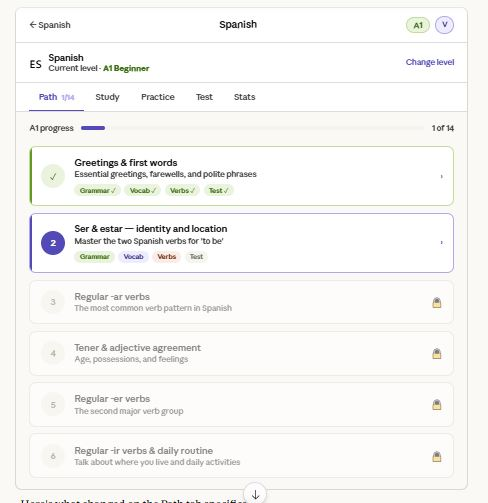
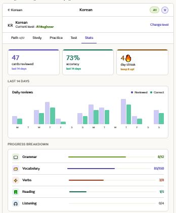
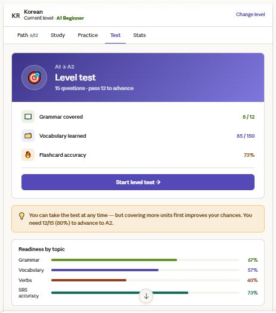
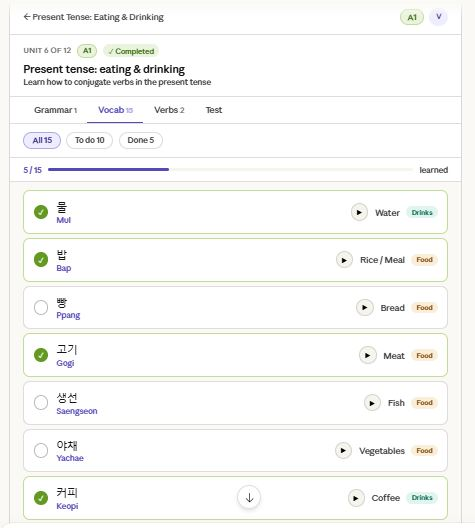

# Home page redesign notes

Here's a redesigned homepage. The key changes from your current design:
What changed and why:
The hero card replaces the flat white progress block with a purple gradient that gives the page an immediate focal point and sense of energy. Purple is intentional — it's not a semantic color (not red/green/yellow), so it works as a brand identity color without carrying warning or success connotations.
The stats row uses colored accent values instead of plain black numbers. Small touch, but it makes the numbers feel like achievements rather than just data.
The quick practice cards each get a colored icon background — purple, teal, amber — giving each section a distinct identity that will carry through to the actual pages (Flashcards always purple, Verb Drill always teal, etc.). This is the "color personality" your app is missing right now.
The streak chip in the navbar gets amber coloring so it always catches the eye.
The broader system I'd suggest:

Purple → flashcards / SRS / practice
Teal → reading / listening / comprehension
Amber → streak / stats / culture
Green → grammar / completed states
Coral → verb drill / drills

---

# Study tab redesign notes

The Study tab now has each section color-coded with a top accent bar, colored icon background, and a matching progress bar — so Grammar is always green, Vocab always purple, Verbs always coral, and so on. 

---

# Unit page redesign notes

Here's what changed on the Path tab specifically:
The unit numbers are now meaningful at a glance — a purple filled circle means "you're here", a green checkmark means "done", a grey muted number means "locked". The left-side colored indicator bar (purple for active, green for complete) reinforces this without relying on the number alone.
The content pills inside the active unit (Grammar, Vocab, Verbs, Test) use the same color system as the Study tab — so green always means grammar, purple always means vocab, coral always means verbs. When a section is complete those pills will show a checkmark. This gives learners a micro progress view right inside the unit row without needing to open it.
The slim A1 progress bar just below the tabs is a small addition but makes the overall journey feel more tangible.
The three mockups together give you a complete color system to implement

---

# Stats page redesign notes
Stats page — the emptiest-feeling page in the app. Two big purple numbers on white cards, then a completely blank chart area. The "Complete a flashcard session to see your stats" message is fine but the whole page feels unfinished. Even with zero data it should feel structured and promising, not abandoned.

The Stats page now has a real chart with paired reviewed/correct bars, colored stat cards with accents, and a progress breakdown using the full color system. 

---

# Level advancement page redesign notes

Level Test page — this is the biggest missed opportunity. One lonely card with a dart emoji on a mostly empty page. For something as significant as a level advancement test, it should feel like an event — something that builds a little anticipation. Right now it looks like a bug.

The Level Test page now feels like a real milestone — a purple gradient hero with the A1→A2 framing, a readiness breakdown so users can see where they stand before committing, and an amber tip card that sets expectations.

---

# Vocab page redesign

