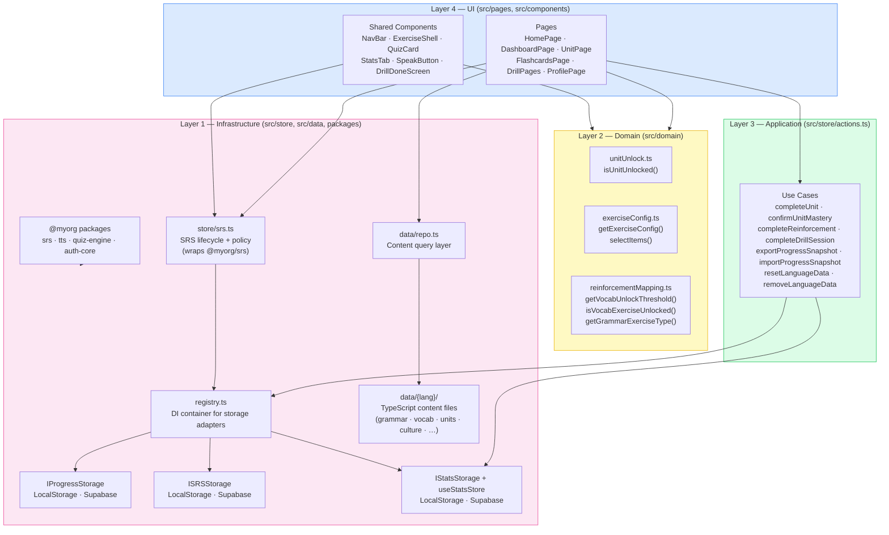
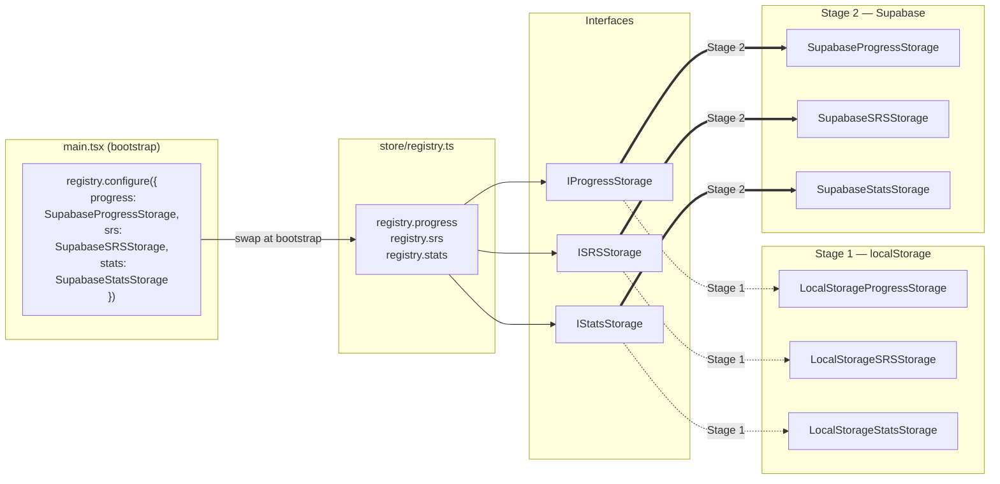
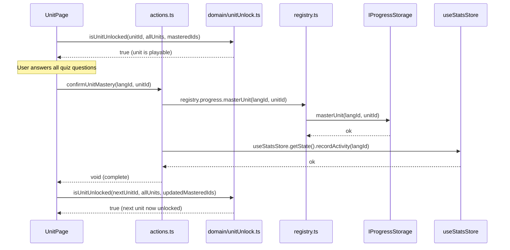
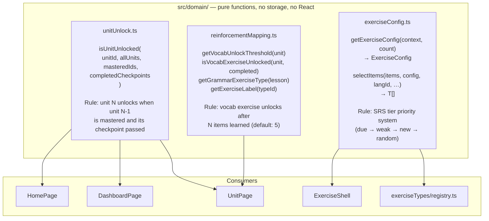
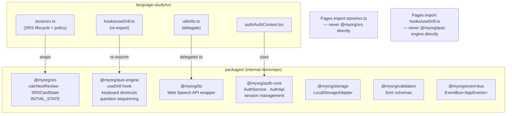

# Language Study App — Architecture Diagrams

**Last updated: 2026-04-13**

---

## 1. Four-layer overview

---

## 2. Storage adapter seam (Stage 1 → Stage 2)

---

## 3. Data flow — "user completes a unit"

---

## 4. Content assembly pipeline

```mermaid
graph LR
    subgraph Files["src/data/{lang}/"]
        G["grammar/a1/*.ts\ngrammar/a2/*.ts\n…"]
        V["vocab/a1.ts\nvocab/a2.ts\n…"]
        U["units/a1.ts\nunits/a2.ts\n…"]
        C["culture/a1/*.ts\n…"]
        R["reading/a1.ts\n…"]
        L["listening/a1.ts\n…"]
        Q["questions/placement.ts\nquestions/level-tests.ts"]
    end

    subgraph Factory["data/moduleFactory.ts"]
        CMF["createLanguageModule(slices)\n• flattens per-level arrays\n• stamps language field\n• returns LanguageModule"]
    end

    subgraph Cache["data/modules.ts"]
        MC["Map&lt;langId, LanguageModule&gt;\nloadModule(langId) — dynamic import\ncached after first load"]
    end

    subgraph Repo["data/repo.ts"]
        QF["Named query functions\ngetGrammarForLevel()\ngetVocabForLevel()\ngetUnitsForLevel()\ngetCultureEpisodesForLevel()\n…"]
    end

    Files --> CMF
    CMF --> MC
    MC --> QF
    QF -->|"Pages call repo.ts only\n(never getModule directly)"| Pages
```

---

## 5. Domain layer — what lives where

---

## 6. Monorepo package boundaries

